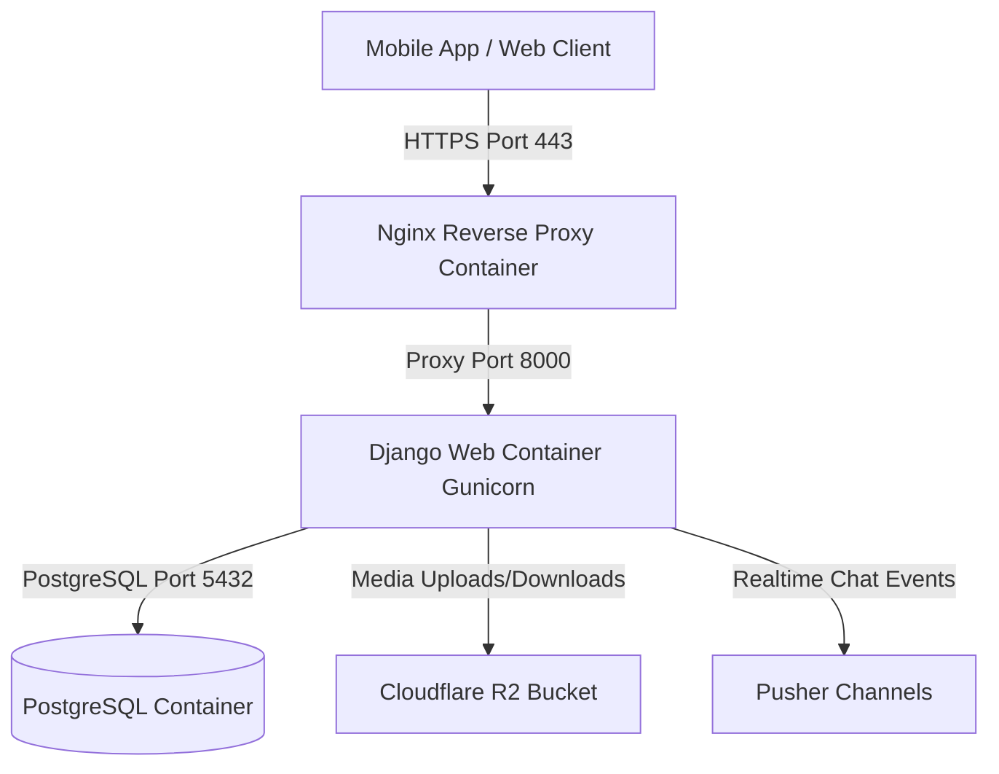

# VPS Deployment Guide for Box-4 Backend

This guide details how to deploy the **Box-4 Backend** (Django REST API, PostgreSQL, Nginx, Gunicorn, Cloudflare R2, and Pusher) to a Virtual Private Server (VPS) such as DigitalOcean, AWS EC2, Linode, Hetzner, Vultr, or Contabo.

---

## 📋 Overview of Deployment Architecture



---

## 🚀 Quick Deployment Guide

### 1. Initial VPS Setup (One-time Setup)

Connect to your fresh Ubuntu/Debian VPS via SSH:
```bash
ssh root@<your-vps-ip-address>
```

Clone your repository to the VPS:
```bash
cd /var/www
git clone <your-git-repository-url> box4-backend
cd box4-backend
```

Run the automated server setup script:
```bash
./setup_vps.sh
```

*(This script installs Docker, Docker Compose, UFW Firewall, Git, Certbot, and configures open ports 22, 80, and 443).*

---

### 2. Configure Production Environment Variables

Create your production environment file `.env.prod`:
```bash
cp .env.example .env.prod
nano .env.prod
```

Configure your production credentials in `.env.prod`:
```env
# Django Settings
SECRET_KEY=generate_a_secure_random_string_here
DEBUG=False
ALLOWED_HOSTS=api.yourdomain.com,<your-vps-public-ip>,localhost

# PostgreSQL Database Settings
POSTGRES_DB=box4_prod_db
POSTGRES_USER=box4_prod_user
POSTGRES_PASSWORD=your_strong_db_password_here

# Email SMTP Settings
DEFAULT_FROM_EMAIL=no-reply@yourdomain.com
EMAIL_HOST=smtp.gmail.com
EMAIL_PORT=587
EMAIL_USE_TLS=True
EMAIL_HOST_USER=your-email@gmail.com
EMAIL_HOST_PASSWORD=your-email-app-password

# Cloudflare R2 (Optional Storage)
USE_R2=True
R2_ACCESS_KEY_ID=your_access_key
R2_SECRET_ACCESS_KEY=your_secret_key
R2_BUCKET_NAME=box4-media
R2_ENDPOINT_URL=https://<account-id>.r2.cloudflarestorage.com
R2_CUSTOM_DOMAIN=media.yourdomain.com

# Pusher Realtime Chat
PUSHER_APP_ID=your_app_id
PUSHER_KEY=your_pusher_key
PUSHER_SECRET=your_pusher_secret
PUSHER_CLUSTER=mt1
```

---

### 3. Deploy Application Containers

Run the automated deployment script:
```bash
./deploy.sh
```

What `deploy.sh` does automatically:
1. Pulls latest updates from Git.
2. Builds Docker images for Django Web and Nginx.
3. Launches PostgreSQL database, Django Gunicorn WSGI server, and Nginx reverse proxy containers.
4. Executes database migrations (`python manage.py migrate`).
5. Collects static assets (`python manage.py collectstatic`).
6. Displays container health status.

---

### 4. Setup Domain Name & Free SSL Certificate (HTTPS)

#### Step 4.1: Point Domain DNS
Add an `A` record in your DNS provider (Cloudflare, Namecheap, GoDaddy):
- **Type**: `A`
- **Name**: `api` (or `@` for root domain)
- **IPv4 Address**: `<your-vps-ip-address>`

#### Step 4.2: Update Nginx Configuration
Open `nginx/nginx.conf`:
```bash
nano nginx/nginx.conf
```
Replace `server_name localhost;` with your domain:
```nginx
server_name api.yourdomain.com;
```

#### Step 4.3: Generate Free SSL Certificate using Certbot
```bash
sudo certbot --nginx -d api.yourdomain.com
```

Certbot will automatically update your Nginx configuration to enable SSL and HTTP-to-HTTPS redirect.

Restart the deployment containers to reload Nginx configuration:
```bash
./deploy.sh
```

---

## 🛠️ Maintenance & Useful Commands

| Action | Command |
| :--- | :--- |
| **Deploy / Update Code** | `./deploy.sh` |
| **View Live Container Logs** | `docker compose -f docker-compose.prod.yml logs -f` |
| **View Web Application Logs** | `docker compose -f docker-compose.prod.yml logs -f web` |
| **Restart All Services** | `docker compose -f docker-compose.prod.yml restart` |
| **Stop All Services** | `docker compose -f docker-compose.prod.yml down` |
| **Run Django Shell** | `docker compose -f docker-compose.prod.yml exec web python manage.py shell` |
| **Create Superadmin / Admin** | `docker compose -f docker-compose.prod.yml exec web python manage.py createsuperuser` |
| **Seed Initial Plans & Properties** | `docker compose -f docker-compose.prod.yml exec web python manage.py seed_db` |

---

## 🔒 Security Best Practices

1. Keep `DEBUG=False` in `.env.prod`.
2. Generate a unique `SECRET_KEY` (e.g. `python -c "import secrets; print(secrets.token_urlsafe(50))"`).
3. Ensure ports 5432 (Postgres) and 8000 (Django) are NOT exposed publicly; only Nginx ports 80/443 should be open in UFW.
4. Back up your database volume periodically (`postgres_prod_data`).
